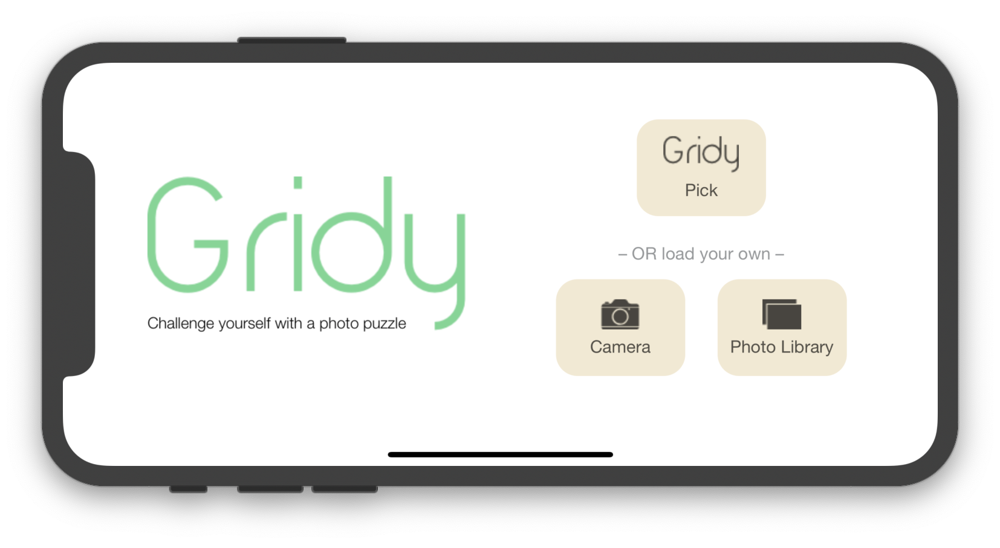

#  OpenClassrooms - iOS developer path - Project 5
## Gridy puzzle maker game
<b>Tech:</b>  
UserDefaults  
Multiple touch recognization  
Sound effects  
iPhone, iPad support for landscape & portait mode

<b>Overview</b>  
Simple puzzle game, which allows user to create puzzle of 16 pieces -> user can take image from camera or his current photo library. It also has got few default images under button "Gridy Pick" for you to play puzzle.  
Once user choose and Image, he is be able to resize it, rotate as he wishes, to have the best puzzle experience.  
App is counting all puzzle tiles moved by user to grid and swiped out of the grid, this represents score.  
User is able to see completed puzzle image under hint button.  
Once puzzle are completed correctly, user will have option to share his score (moves) and image he made or simply start new game

### Portrait

 

### Landscape

